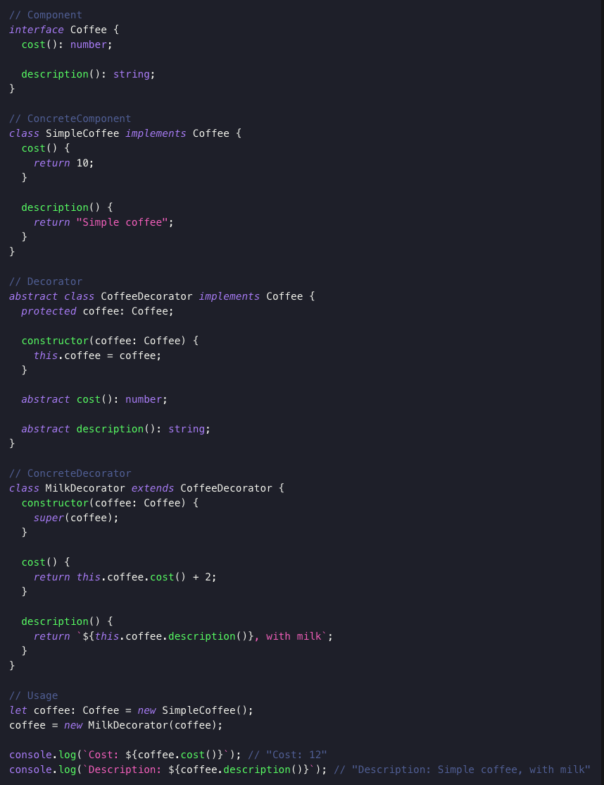
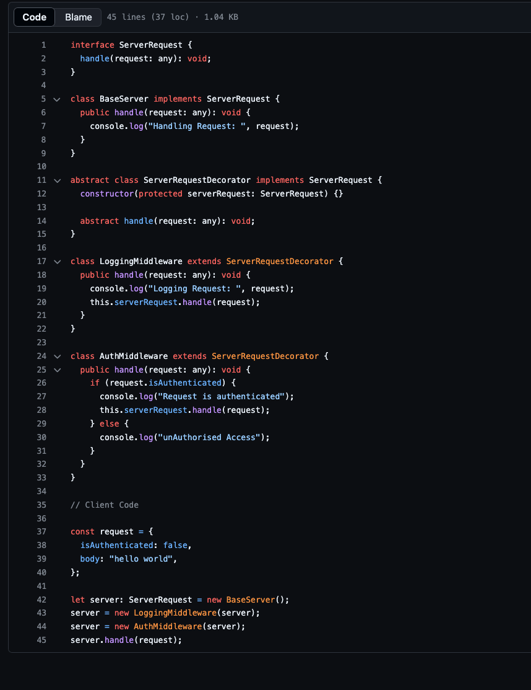

### Course: Design Patterns in Typescript
### Structural Design Pattern: Composite Pattern, Decorator Pattern, Adapter Pattern. 

# Lecture on Composite Pattern (Structural Design) (85 to 90)
- Compose Objects into Tree Like Structure with the goal of working with this object independently.
- Components: Component, Leaf and Composite.
- Component: Common interface which will be shared between leafs. 
- Leaf: Individual independent classes which will be implementing the interface component. 
- Composite: This extends the Common Component Interface. 
- Think of tree like structure when you are discussing composite pattern.
- In a tree, what are the mediatory nodes called? Nodes with children/child?? 
- You use composite pattern when you are working with nested objects/ hierarchical objects.
- Reduce, splice, indexOf, map methods?? 
- Extension of component is easy in case of composite pattern.
- Difficulty in type checking when you implement a composite pattern in typescript. Think about accessing leaf through the composite interface implemented object.
- It can violate single responsibility principle. It also introduces a lot of coupling, as the composite's functionality is directly coupled with leaf nodes. As you use composite you would be invoking leaf node's methods.
- Composite is a structural design pattern that lets you compose objects into tree structures and then work with these structures as if they were individual objects. [1]
- The Composite pattern provides you with two basic element types that share a common interface: simple leaves and complex containers. A container can be composed of both leaves and other containers. This lets you construct a nested recursive object structure that resembles a tree.
- It might be difficult to provide a common interface for classes whose functionality differs too much. In certain scenarios, you’d need to overgeneralize the component interface, making it harder to comprehend.

# Lecture on Decorator Pattern (Structural Design) (91 to 96) [2]
- Can be categorized under both structural and behavioral pattern.
- Allows you to dynamically add or override behavior in an existing object without changing its implementation. 
- Most used use case is when you would want to modify the behavior of an object without affecting other objects of the same class.
- Components of Decorator: Component, ConcreteComponent, Decorator and ConcreteDecorator.
- protected access modifier's scope in typescript? When will you be using it?
-  Use of super keyword to make an object accessible. You use super when you extend an abstract class? What about when you are extending a general class.
- This very good example, has to be included, says everything about decorator:

- When extending a class is not viable then it can be a use case for the Decorator Pattern.
- Concrete implementation vs signature terminologies in abstract class implementation??
- Another good example of how server frameworks like express and nest use decorators:

- Decorator helps you in avoiding sub-classing. Decorators also follow SRP.
- Decorator pattern's extensive implementation can lead to breakdown of objects into multiple small objects.
- Since in decorator pattern, same interface is implemented, how would you go about introducing an optional method in the interface which might be required in one of the decorator?
- The order of implementation of decorator is a very important factor in decorator pattern. 
- Use the pattern when it’s awkward or not possible to extend an object’s behavior using inheritance. Many programming languages have the final keyword that can be used to prevent further extension of a class. For a final class, the only way to reuse the existing behavior would be to wrap the class with your own wrapper, using the Decorator pattern. [5]
- More sophisticates use case and implementation: [5]

# Lecture on Adapter Pattern (Structural Design) (97 to 102) [3]
- Adapter pattern has many major advantages
- Adapter pattern also introduces coupling if the adoptee is volatile.
- Adapter pattern increase documentation as it introduces ambiguity in your code.
- Communicating with legacy system a lot of time involves Adapter Pattern.
- Plug in architecture like VS code make use of adapter pattern. They have standardized adapter to which plug ins are attached.
- The Adapter Design Pattern is a software design pattern that allows the interface of an existing class to be used from another interface. It's often used to make existing classes work with others without modifying their source code. The Adapter Pattern is especially useful when the classes that need to communicate with each other do not have compatible interfaces.
- The Adapter Design Pattern can be implemented in two ways:
    - Object Adapter Pattern: This pattern uses composition to adapt the interface of a specific object.
    - Class Adapter Pattern: This pattern uses inheritance to adapt a class to another interface.
- Object Adapter Pattern is the more commonly used approach and TypeScript doesn't fully support classical inheritance.
- Use Case of Adapter Pattern: Abstracting Vocal Classes: Encapsulation of classes prone to frequent changes, minimizing impact on the rest of the application.
- Use Case of Adapter Pattern: Alternatives to Multiple Inheritance: A class needs to inherit behavior from multiple sources in languages that don't support multiple inheritance
- Check this out for implementation: [4]

# References:
[1]: https://refactoring.guru/design-patterns/composite
[2]: https://cloudaffle.com/series/structural-design-patterns/decorator-pattern/
[3]: https://cloudaffle.com/series/structural-design-patterns/adapter-pattern/
[4]: https://refactoring.guru/design-patterns/adapter
[5]: https://refactoring.guru/design-patterns/decorator